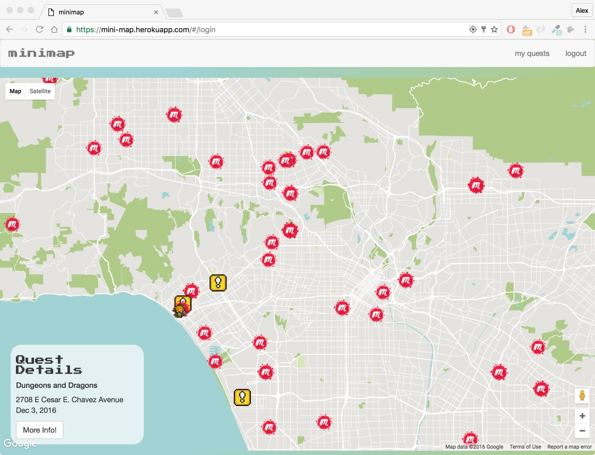
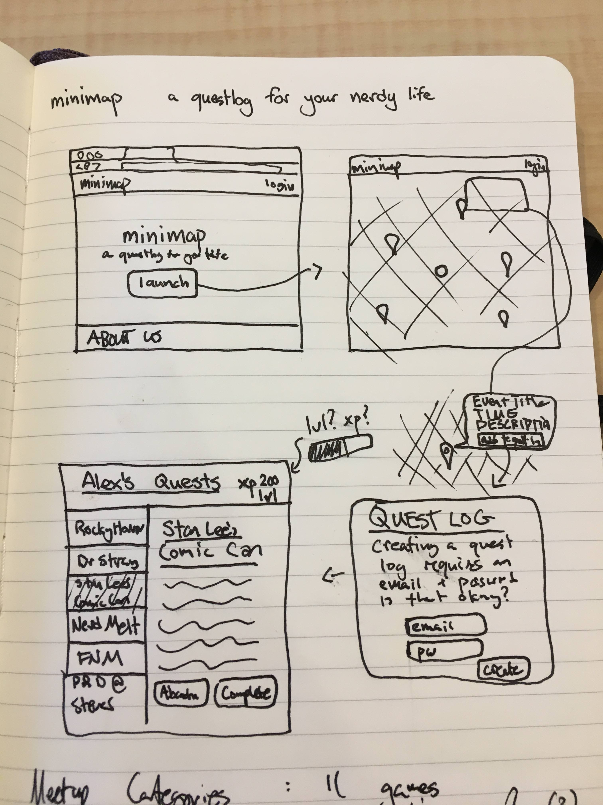

#minimap
___

## - a minimap for your nerdy life

Inspired by pressing start on any great video game, minimap attempts to replicate the "availible quests" experience for you irl.

After allowing minimap access to their current locations, users are dropped into their local environment with an assortment of quest markers scattered around them. These markers are generated by other users and by a meetup database of local nerdy events. Clicking on markers brings up the quick details for that quest, clicking that info window for more information will bring up a link to join that event.

#### How to Use:

Try minimap <a href="https://mini-map.herokuapp.com/" title="minimap"> RIGHT HERE, RIGHT NOW</a>.

---

### Development & Technologies
Minimap is being built using MEAN stack technologies (Mongo, Express, Angular, and Node). The following technologies are also sprinkled in for good measure: gulp, ngmaps, geocoder, bootstrap, angular ui-bootstrap, and passport.

Early wireframes

---

### User Stories

+ When I arrive at the website, I am immediatly given access to information about cool nerdy events around me.
+ I am invited, but not forced, to join the community to contribute events myself.
+ I am able to easily create a password protected account and begin creating events.
+ When clicking markers, I am given a small amount of information quickly, but I can ask for more information.

---
### MVP
+ Users can create events and see the events of others on a map
+ RESTful routes to create and access api data related to user events
+ Users should be able to sign up for authenticated accounts
+ Deployed publicly to heroku

---
### Dream Features
+ Meetup events populate as you move the map
+ Search bar so users can research places further afield without dragging the map
+ Questlog where users can save events that interest them
+ Users get experience for attending events, can level up
+ Links to share events with friends
+ User generated events auto archive after the event takes place

---

### Bugs
+ user events with vague locations end up with markers in the middle of nowhere
+ user event details don't display correctly on pop-up
+ login button doesn't work on Chrome for iPhone

---

### This project would have been lame without help from:

| 🤘 [philuchansky](https://github.com/philuchansky) | 🚴 [jimbog](https://github.com/jimbog) | 🏑 [garrettestrin](https://github.com/garrettestrin) | 💻 [kevinpagtakhan](https://github.com/kevinpagtakhan) | 👾 [plin0168](https://github.com/plin0168) | 💨 [troycarson100](https://github.com/troycarson100) | 🍟 [abregorivas](https://github.com/abregorivas) |